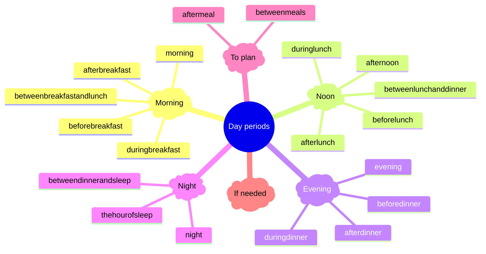

## Description

See if software in test can handle all the authorized [CD-DAYPERIOD](https://www.ehealth.fgov.be/standards/kmehr/en/tables/dayperiod) by [MS Cookbook](https://www.ehealth.fgov.be/standards/kmehr/file/cc73d96153bbd5448a56f19d925d05b1379c7f21/057e64396c1ea312a0b01607b0f94e4adcf456e8/20210331-safe_cookbook_medicatieschema_v5.8_en.pdf) :

```xml title="Example"
...
<transaction>
    ...
    <item>
        <id S="ID-KMEHR" SV="1.0">2</id>
        <cd S="CD-ITEM" SV="1.11">medication</cd>
        ...
        <regimen>
            ...
            <daytime>
                <dayperiod>
                    <!-- The focus on the test -->
                    <cd S="CD-DAYPERIOD" SV="1.0">morning</cd>
                </dayperiod>
            </daytime>
        </regimen>
    </item>
    ...
</transaction>
...
```

## Test cases

In other words, all values of [CD-DAYPERIOD](https://www.ehealth.fgov.be/standards/kmehr/en/tables/dayperiod) except these ones prohibited by [MS Cookbook](https://www.ehealth.fgov.be/standards/kmehr/file/cc73d96153bbd5448a56f19d925d05b1379c7f21/057e64396c1ea312a0b01607b0f94e4adcf456e8/20210331-safe_cookbook_medicatieschema_v5.8_en.pdf) :
    - aftermeal
    - betweenmeals
    - afternoon
    - evening
    - night

## Files

- [XML file](https://github.com/smals-jy/KMEHR-tests/blob/main/output/ms/TS-04-CD-DAYPERIOD.xml)
- [Configuration file](https://github.com/smals-jy/KMEHR-tests/blob/main/configurations/ms/TS-04-CD-DAYPERIOD.ts)

## Expected results 

When looking to the patient medication scheme, for each value authorized :
    - The medication must be present (for easiness, they all have daily periodicity)
    - The day period translation to humans should respect [CD-DAYPERIOD](https://www.ehealth.fgov.be/standards/kmehr/en/tables/dayperiod) table
    - According [Vitalink PDF specifications](https://www.vitalink.be/sites/default/files/2022-05/Safe_Cookbook_PDFmedicatieschema_v1_0.pdf), medication should be put in the correct section of day according to their value

