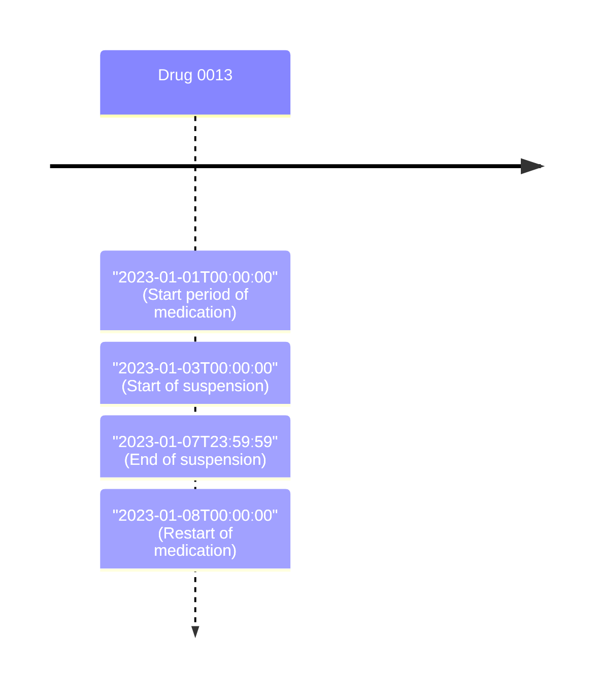

import Tabs from '@theme/Tabs';
import TabItem from '@theme/TabItem';

See if software in test can handle the formats of duration possible in KMEHR, authorized by [MS Cookbook](https://www.ehealth.fgov.be/standards/kmehr/file/cc73d96153bbd5448a56f19d925d05b1379c7f21/057e64396c1ea312a0b01607b0f94e4adcf456e8/20210331-safe_cookbook_medicatieschema_v5.8_en.pdf) :

```xml title="Example"
...
<transaction>
    ...
    <item>
        <id S="ID-KMEHR" SV="1.0">2</id>
        <cd S="CD-ITEM" SV="1.11">medication</cd>
        ...
        <beginmoment>
          <date>2023-01-01</date>
        </beginmoment>
        ...
        <!-- The focus of the test -->
        <duration>
            <decimal>5</decimal>
            <unit>
                <cd S="CD-TIMEUNIT" SV="2.0">d</cd>
            </unit>
        </duration>
        ...
    </item>
    ...
</transaction>
...
```

## Test cases

- All values of [CD-TIMEUNIT](https://www.ehealth.fgov.be/standards/kmehr/en/tables/time-unit), authorized by [MS Cookbook](https://www.ehealth.fgov.be/standards/kmehr/file/cc73d96153bbd5448a56f19d925d05b1379c7f21/057e64396c1ea312a0b01607b0f94e4adcf456e8/20210331-safe_cookbook_medicatieschema_v5.8_en.pdf)
- Medication lines suspended by `<duration>`

## Files

- [XML file](/output/ms/TS-13-duration.xml)
- [Configuration file](https://github.com/smals-jy/KMEHR-tests/blob/main/configurations/ms/TS-13-duration.ts)

## Expected results

When looking to the patient medication scheme, all these criterias must be fulfilled :
    - All values of [CD-TIMEUNIT](https://www.ehealth.fgov.be/standards/kmehr/en/tables/time-unit), authorized by [MS Cookbook](https://www.ehealth.fgov.be/standards/kmehr/file/cc73d96153bbd5448a56f19d925d05b1379c7f21/057e64396c1ea312a0b01607b0f94e4adcf456e8/20210331-safe_cookbook_medicatieschema_v5.8_en.pdf) must be supported and have the correct start & end period :

<Tabs>

    <TabItem value="picture" label="Timeline" default>

        <div style={{overflowX: 'auto'}}>
        <div style={{width: '150%'}}>
        ```mermaid
        timeline
            title CD-TIMEUNIT values

            Drug 0002 (with "ms" unit)
                : "2023-01-01T00ː00ː00"
                : "2023-01-01T00ː00ː05"
            Drug 0003 (with "us" unit)
                : "2023-01-01T00ː00ː00"
                : "2023-01-01T00ː00ː00.005"
            Drug 0004 (with "ns" unit)
                : "2023-01-01T00ː00ː00"
                : "2023-01-01T00ː00ː00.000005"
            Drug 0005 (with "s" unit)
                : "2023-01-01T00ː00ː00"
                : "2023-01-01T00ː00ː05"
            Drug 0006 (with "min" unit)
                : "2023-01-01T00ː00ː00"
                : "2023-01-01T00ː05ː00"
            Drug 0007 (with "hr" unit)
                : "2023-01-01T00ː00ː00"
                : "2023-01-01T05ː00ː00"
            Drug 0008 (with "d" unit)
                : "2023-01-01T00ː00ː00"
                : "2023-01-06T00ː00ː00"
            Drug 0009 (with "wk" unit)
                : "2023-01-01T00ː00ː00"
                : "2023-02-05T00ː00ː00"
            Drug 0010 (with "mo" unit)
                : "2023-01-01T00ː00ː00"
                : "2023-06-01T00ː00ː00"
            Drug 0011 (with "a" unit)
                : "2023-01-01T00ː00ː00"
                : "2028-01-01T00ː00ː00"
        ```
        </div>
        </div>
    </TabItem>

    <TabItem value="mermaid" label="Mermaid code">
        ```markup
        timeline
            title CD-TIMEUNIT values

            Drug 0002 (with "ms" unit)
                : "2023-01-01T00ː00ː00"
                : "2023-01-01T00ː00ː05"
            Drug 0003 (with "us" unit)
                : "2023-01-01T00ː00ː00"
                : "2023-01-01T00ː00ː00.005"
            Drug 0004 (with "ns" unit)
                : "2023-01-01T00ː00ː00"
                : "2023-01-01T00ː00ː00.000005"
            Drug 0005 (with "s" unit)
                : "2023-01-01T00ː00ː00"
                : "2023-01-01T00ː00ː05"
            Drug 0006 (with "min" unit)
                : "2023-01-01T00ː00ː00"
                : "2023-01-01T00ː05ː00"
            Drug 0007 (with "hr" unit)
                : "2023-01-01T00ː00ː00"
                : "2023-01-01T05ː00ː00"
            Drug 0008 (with "d" unit)
                : "2023-01-01T00ː00ː00"
                : "2023-01-06T00ː00ː00"
            Drug 0009 (with "wk" unit)
                : "2023-01-01T00ː00ː00"
                : "2023-02-05T00ː00ː00"
            Drug 0010 (with "mo" unit)
                : "2023-01-01T00ː00ː00"
                : "2023-06-01T00ː00ː00"
            Drug 0011 (with "a" unit)
                : "2023-01-01T00ː00ː00"
                : "2028-01-01T00ː00ː00"
        ```
    </TabItem>

</Tabs>

- Medication line suspended by `<duration>` must be supported and have the correct start & end periods :


